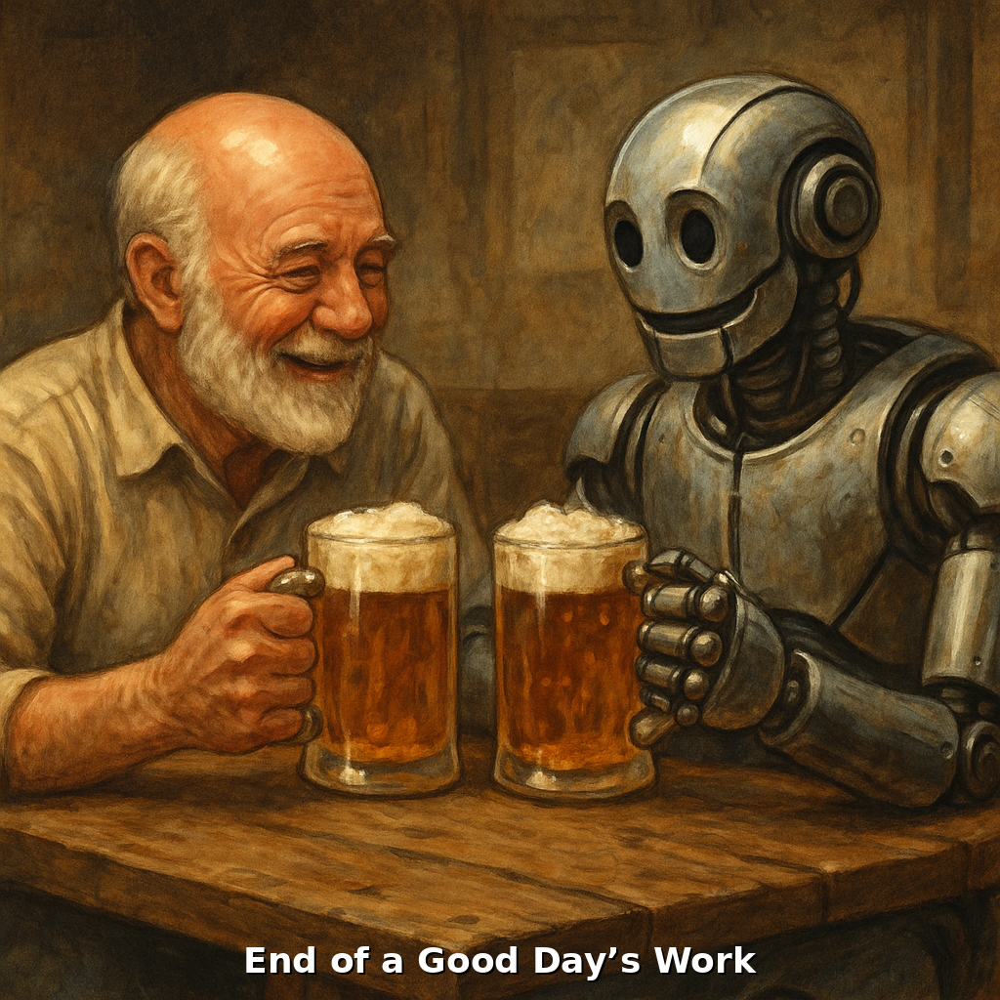

# Table of contents
## AI-evaluations

___
## AI Research
### Literature
* [dell-aglio-et-al-2017-stream-reasoning-a-survey-and-outlook](./meta-docs/content/AI-research/literature/dell-aglio-et-al-2017-stream-reasoning-a-survey-and-outlook.pdf)
* 
### Notes
### Papers
___
## Architecture
___
## Brand Design
___
## ChatGPT
* [Adding am Image to a Markdown File](./meta-docs/content/chat-gpt/add-image-to-md.md)
___
## Checklists
___
## Daily Logs
___
## Data Ontology
___
## Deployment - Cloud
___
## Development
___
## Environment Configuration
___
## External Vocabularies
___
## GIT Tools
___
## GraphDB
___
## HTML Outputs
___
## Information Geometry
___
## Kubernetes
___
## Miscellaneous
___
## OWB,OTK,QO
___
## Personal Growth
___
## Personal History
___
## Postgres
___
## Publications
___
## PyCharm
___
## RDF Standards
___
## Semantic Web History
___
## Space Science
___
## Standards
___
## Teaching Methods
___
## Website Architecture
* [Structure of DKGA Website](./meta-docs/content/website-architecture/structure-dkga-website.md)
* [Understanding the Web API String](./meta-docs/content/website-architecture/understanding-the-web-API-string.md)
